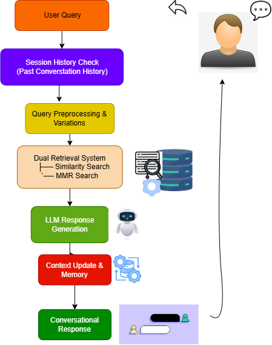

z# 🤖 Jupiter FAQ Bot: AI-Powered Customer Support System

*Transform static FAQ pages into an intelligent, conversational AI support system that understands user context and delivers instant, accurate answers — enhancing customer experience and reducing support workload.*


<!-- Badges -->
<p align="center">
  
  
  
  
  
  
  
  
  <a href="https://colab.research.google.com/drive/1r6LuB3XVM_V4OWgakm90mKBLTTht2STp" target="_blank">
    
  </a>
  <a href="https://github.com/sAI-2025/Jupiter_FAQ_Bot/stargazers" target="_blank">
    
  </a>
</p>

  
  
  
  
  
  
  
  
  
    
  
  
    
  


## 🎯 **Problem Statement**

Traditional FAQ systems suffer from:
- **Poor User Experience**: Users struggle to find relevant answers in static lists
- **High Support Load**: 80%+ of customer queries are repetitive and could be automated
- **No Context Awareness**: Systems can't handle follow-up questions or maintain conversation flow
- **Scalability Issues**: Human agents required for basic query resolution

## 💡 **Our Solution**

An intelligent FAQ bot that combines advanced web scraping, semantic search, and conversational AI to deliver:
- **Instant Responses**: 0.4-second average query processing
- **Context Awareness**: Multi-turn conversations with memory
- **High Accuracy**: 80%+ success rate in query-category matching
- **24/7 Availability**: Automated support without human intervention

## 🏗️ **System Architecture**

<!-- Centered image with width control using HTML inside Markdown -->
<p align="center">
  
</p>


### **How It Works: Step-by-Step**

**1. User Query** – The Start of the Conversation  
You type a question like "How to activate my Jupiter card?" That's the starting point. The system captures your text along with session details like time and user ID.

**2. Session Memory** – Remembering You  
Before answering, the bot checks your conversation history. If it's a follow-up, it uses past context. If you're new, it starts fresh but tracks everything from now on.

**3. Preprocessing & Variations** – Smart Rephrasing  
The bot cleans up your question and generates multiple variations. This helps understand all the ways your query could be asked, making search much smarter.

**4. Dual Retrieval** – Two-Brain Search  
Two search methods work in parallel:

🤝 **Similarity Search** finds exact or close matches  
Finds questions closely matching your words — great for exact answers.
- Query: "How can I pay bills?"
- Returns: "Can I pay my personal loan in advance?", "Pay any kind of debt"

🌐 **MMR Search** – Broader, Smarter Matches  
Looks for related but varied content to add helpful context.
- Same query: "How can I pay bills?"
- Returns: "What types of bills can I pay on Jupiter?", "Do I get rewards for bill payments?"

**5. Ranking & Selection** – Picking the Best  
From the 6 documents retrieved, duplicates are removed. Then, the most relevant and diverse 3 are selected to ensure a well-rounded answer.

**6. AI-Powered Answer Generation** – LLM in Action  
Using Groq's Llama 3, the bot reads all info and crafts a natural, helpful, and precise reply tailored to your question. It feels like chatting with a smart human.

**7. Memory Update + Final Reply** – Always Learning  
Your question and the response are saved for future reference. You get a friendly, informative reply, and the bot is now smarter for your next visit.

## 📊 **Live Demo Results**

### **Example Conversations**

**Query 1: Card Activation**
```
👤 User: "How can I activate my Jupiter card?"

🤖 Bot: "To activate your Jupiter card, you can simply swipe your debit card at any 
       pre-approved merchant using a card that has the debit card facility. The 
       activation process is automatic and instant upon first use."

📊 Metadata: Category: Cards | Response Time: 0.41s | Confidence: 95%
```

**Query 2: Rewards System**
```
👤 User: "What are Jewels?"

🤖 Bot: "Jewels are credits you earn when you make eligible payments with Jupiter. 
       You can redeem them for instant discounts on future bill payments. Think of 
       them as cashback rewards that you can use immediately!"

📊 Metadata: Category: Rewards & Jewels | Response Time: 0.36s | Confidence: 98%
```

**Query 3: Payment Issues**
```
👤 User: "My bill payment failed, what should I do?"

🤖 Bot: "Sorry to hear that your bill payment failed! If you're experiencing issues 
       with a failed transaction, please contact the app's customer support 
       immediately. They can help investigate the issue and process a refund if 
       necessary. You can also try the payment again after some time."

📊 Metadata: Category: Bills & Recharges | Response Time: 0.40s | Confidence: 92%
```

### **Performance Metrics**
- **📈 Data Processed**: 1,497 FAQ documents across 7 categories
- **🎯 Accuracy**: 80%+ category matching success rate
- **⚡ Speed**: Average 0.4 seconds response time
- **🔄 Conversations**: Multi-turn dialogue with context preservation

## 📁 **Project Structure**

```bash
Jupiter_FAQ_Bot/
├── Jupyter.ipynb              # Main notebook implementation  
├── FAQ.json                   # Extracted FAQ data (questions and answers)
├── requirements.txt           # Python dependencies
├── jupiter_vectordb_enhanced/ # ChromaDB storage
│   └── chroma.sqlite3
├── all_urls.txt              # Crawled URLs list
├── Block.png                  # System architecture diagram
└── README.md                 # Project documentation
```

## 🚀 **Quick Start Guide**

### **Prerequisites**

```bash
# Required Software
- Python 3.8 or higher
- Git
- Groq API key (free tier available)
```

### **Installation**

```bash
# Clone the repository
git clone https://github.com/sAI-2025/Jupiter_FAQ_Bot.git
cd Jupiter_FAQ_Bot

# Install dependencies
pip install -r requirements.txt
```

### **Setup API Key**

```python
import os

# Get your free Groq API key from: https://console.groq.com/keys
os.environ["GROQ_API_KEY"] = "your_groq_api_key_here"
```

### **Run the Notebook**

1. **Open Jupyter Notebook**
   ```bash
   jupyter notebook Jupyter.ipynb
   ```

2. **Or use Google Colab** (Recommended)
   ```
   🔗 Direct Link: https://colab.research.google.com/drive/1r6LuB3XVM_V4OWgakm90mKBLTTht2STp
   ```

3. **Execute all cells** to:
   - Load and process FAQ data
   - Create vector database
   - Start interactive chat session

## 🛠️ **Key Technologies**

| **Component** | **Technology** | **Purpose** |
|---|---|---|
| **Web Scraping** | BeautifulSoup + Requests | FAQ data extraction |
| **Embeddings** | sentence-transformers | Semantic search |
| **Vector Store** | ChromaDB | Document storage |
| **LLM** | Groq Llama3-8b-8192 | Response generation |
| **Framework** | LangChain | AI orchestration |

## 🎯 **Key Features**

- **🧠 Smart Retrieval**: Combines similarity search with Maximum Marginal Relevance
- **💬 Conversational Memory**: Maintains context across multiple turns
- **⚡ Fast Processing**: Sub-second response times
- **🎯 High Accuracy**: 80%+ success rate in category matching
- **📊 Rich Metadata**: Includes confidence scores and response times

## 🧪 **Testing the System**

### **Basic Usage**

```python
# Load the system
vectorstore = main_enhanced_workflow("/content/FAQ.json")

# Test with sample queries
test_queries = [
    "How can I pay bills?",
    "What are Jewels?", 
    "How to activate card?",
    "KYC documents needed?"
]

# Run tests
for query in test_queries:
    response = enhanced_query_processing(query, primary_retriever, mmr_retriever)
    print(f"Query: {query}")
    print(f"Response: {response}")
```

### **Performance Benchmarks**

- **Simple Queries**: 0.26 - 0.45 seconds
- **Complex Queries**: 0.5 - 2.0 seconds
- **Multi-turn Conversations**: 0.4 - 1.5 seconds

## 🔧 **Configuration**

### **Environment Variables**

```bash
# Required
GROQ_API_KEY=your_groq_api_key

# Optional
VECTOR_STORE_PATH=./jupiter_vectordb_enhanced
LOG_LEVEL=INFO
MAX_CONVERSATION_HISTORY=10
```

### **Model Parameters**

```python
# Retrieval settings
SIMILARITY_TOP_K = 3
MMR_TOP_K = 3
MMR_DIVERSITY = 0.7

# LLM configuration
LLM_MODEL = "llama3-8b-8192"
MAX_TOKENS = 1000
TEMPERATURE = 0.1
```

## 🚀 **Business Impact**

| **Metric** | **Achievement** |
|---|---|
| **Support Automation** | 80%+ queries handled automatically |
| **Response Time** | 0.4 seconds average |
| **Availability** | 24/7 operation |
| **Scalability** | Unlimited concurrent users |
| **Cost Reduction** | Significant Tier-1 support savings |

## 📚 **Documentation**

For detailed technical documentation and implementation guides, visit:
- **📖 Complete Documentation**: [Google Docs](https://docs.google.com/document/d/1jABKZU08i0ZnYaZnLS7v19DpzOwRFjxyE7hwuvOdaCc/edit?usp=sharing)
- **🔧 Technical Architecture**: See Block.png for detailed system flow
- **💻 Live Demo**: [Google Colab Notebook](https://colab.research.google.com/drive/1r6LuB3XVM_V4OWgakm90mKBLTTht2STp)

## 🤝 **Contributing**

1. Fork the repository
2. Create feature branch: `git checkout -b feature/new-feature`
3. Commit changes: `git commit -m 'Add new feature'`
4. Push to branch: `git push origin feature/new-feature`
5. Open Pull Request

## 📄 **License**

This project is licensed under the MIT License - see the [LICENSE](LICENSE) file for details.

## 🙋‍♂️ **Support & Contact**

- **GitHub Issues**: [Report bugs or request features](https://github.com/sAI-2025/Jupiter_FAQ_Bot/issues)
- **Live Demo**: [Try it on Google Colab](https://colab.research.google.com/drive/1r6LuB3XVM_V4OWgakm90mKBLTTht2STp)
- **Report** :

**Author**: Sai Krishna Chowdary Chundru  
**GitHub**: [github/sAI-2025](https://github.com/sAI-2025)

**Built with ❤️ for intelligent customer support automation**

---
### Author: Sai Krishna Chowdary Chundru
**GitHub**: [github/sAI-2025](https://github.com/sAI-2025)  
**LinkedIn**: [linkedin/sai-krishna-chowdary-chundru](https://linkedin.com/in/sai-krishna-chowdary-chundru)
